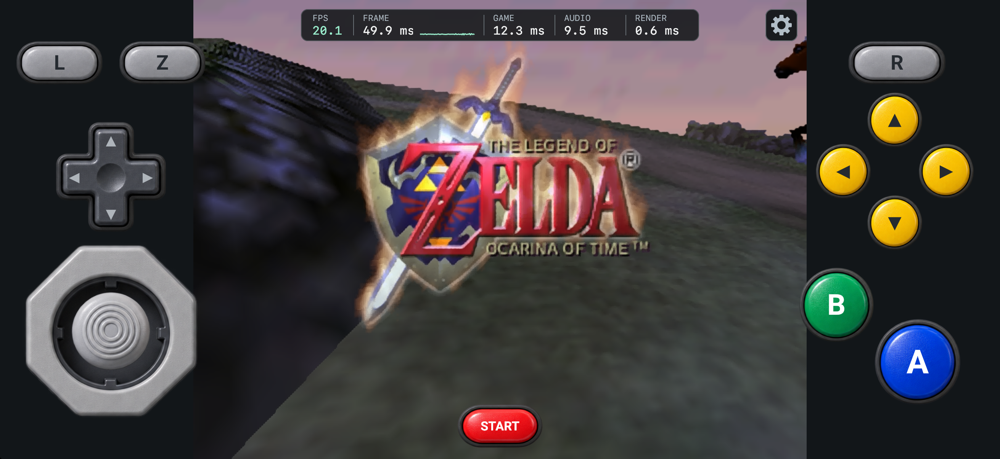

# zoot


zoot is a Kotlin Multiplatform project that makes The Legend of Zelda: Ocarina of
Time playable on Android and iOS.

The project was created for a couple of reasons:

- To stress test [Chasm](https://github.com/CharlieTap/chasm) with a N64 era fully 3d game.
- To demonstrate Chasms new codegen runtime and its WASI linking support
- To give people something to play ahead of the return of the 🐐 on November the 5th

It's the second Kotlin Multiplatform game I have produced using Chasm, it differs quite a bit
from [Mood](https://github.com/CharlieTap/mood) for reasons I detail below. The entire project
was agentically engineered, do not expect to see beautifully handcrafted code however the architecture 
and decisions are human made which hopefully makes the source easy to get around.



## How does it work?

The game is compiled into a single WebAssembly binary and runs in Chasm’s
interpreter on both Android and iOS. That was a strict goal from the beginning: I
didn’t want to improve performance by moving substantial parts of the game’s logic
onto the host.

That makes performance challenging, because Chasm is an interpreter. When people
play N64 games on PC, they typically use an emulator that interprets or dynamically
recompiles the console’s CPU instructions and processes its graphics and audio
commands. Running an interpreter based emulator inside Chasm would mean putting an
interpreter inside another interpreter.

Instead, I’ve built on top of a decompilation based port. The reconstructed game code
compiles directly to WebAssembly, removing the need to emulate the original MIPS
CPU. However, the game still produces N64 graphics commands, so those must be
decoded and translated for WebGPU. That decoding, along with audio processing,
stays inside the WebAssembly binary. Surprisingly this is still fast enough for most
modern smartphones, on Android your mileage will vary on Iphone you're chilling, Apple
Silicon is an absolute joke.

Chasm's Gradle plugin generates the Kotlin guest interface and links WASI Preview 1.
Zoot supplies its direct host functions and the filesystem environment for saves.

One of the big differences between zoot and Mood is how we use Chasm's Gradle
plugin. Mood uses [`CodegenRuntime.PORTABLE_VM`][codegen-runtime], which targets a
shared VM API backed by Chasm outside the web and the browser's WebAssembly runtime
on the web. zoot uses [`CodegenRuntime.CHASM`][codegen-runtime] instead, generating
bindings directly against Chasm's embedding API. Our
[`HostFunction`][host-function] implementations can work directly with the
interpreter's stack and guest memory, without allocating temporary argument or
result objects for each host call. We keep the convenient generated Kotlin
interface, but avoid the extra wrappers and allocations of the portable VM API.

[WASI](https://wasi.dev/), the WebAssembly System Interface, gives Wasm code a
standard way to access files, clocks and other host services. With
[`WasiLinking.AUTOMATIC`][wasi-linking], the plugin links our guest's WASI Preview 1
imports for us. Instead of writing custom save-file callbacks as we did in Mood,
we [configure an `EmbedderHost`][wasi-host] with a directory exposed as `/saves` and
destinations for stdout and stderr. The game keeps its file-handling logic in
Wasm, while the WASI library performs the underlying host operations. That means
less host code to maintain, without moving game logic out of the Wasm binary.
This is a pattern you'll see in my future Chasm projects: more functionality
moving into the Wasm binary and a thinner host integration. With support for the
Component Model and WASI WebGPU, we could go further, replacing much of our
remaining custom graphics integration with standard bindings.

[codegen-runtime]: https://github.com/CharlieTap/chasm/blob/2.1.0/chasm-gradle-plugin/src/main/kotlin/io/github/charlietap/chasm/gradle/CodegenConfig.kt#L7
[host-function]: https://github.com/CharlieTap/chasm/blob/2.1.0/host/src/commonMain/kotlin/io/github/charlietap/chasm/host/HostFunction.kt#L48
[wasi-linking]: https://github.com/CharlieTap/chasm/blob/2.1.0/chasm-gradle-plugin/src/main/kotlin/io/github/charlietap/chasm/gradle/CodegenConfig.kt#L27
[wasi-host]: runtime/src/commonMain/kotlin/com/tap/zoot/runtime/wasi/WasiHost.kt

Graphics are drawn through WebGPU on Android and a Metal-backed WebGPU
implementation on iOS. The app provides input, plays the audio and handles saved
games.

The interface is shared using Compose Multiplatform, including the on-screen
N64 controls, settings and performance overlay. 

The game renders at 320 × 240. We leverage [SGSR](https://github.com/SnapdragonGameStudios/snapdragon-gsr) 
 to upscales the result to fit the screen

## How to play?

You'll need to bring "your" own Ocarina of Time ROM. 
We support the following ROMs:

| ROM | SHA-1 (big-endian `.z64` format) |
| --- | --- |
| US N64 1.0 | `ad69c91157f6705e8ab06c79fe08aad47bb57ba7` |
| US N64 1.1 | `d3ecb253776cd847a5aa63d859d8c89a2f37b364` |
| US N64 1.2 | `41b3bdc48d98c48529219919015a1af22f5057c2` |
| Japanese N64 1.0 | `c892bbda3993e66bd0d56a10ecd30b1ee612210f` |
| Japanese N64 1.1 | `dbfc81f655187dc6fefd93fa6798face770d579d` |
| Japanese N64 1.2 | `fa5f5942b27480d60243c2d52c0e93e26b9e6b86` |

Drop your ROM into the directory `rom/` and run the build for your platform. We'll take care of
the rest.

ROMs and extracted game assets are not included in this repository. Keep your ROM,
generated archives and locally built apps private: the apps contain assets extracted
from your ROM. These files are ignored by Git.

### Android

```shell
./gradlew :android:assembleRelease
```

The APK is written to `android/build/outputs/apk/release/android-release.apk`.

### iOS

On a Mac with Xcode and XcodeGen installed:

```shell
./gradlew :ios:assembleRelease
```

To build and launch it in the iOS simulator, run `./gradlew :ios:runRelease`.

## Game source

The game is based on [Shipwright](https://github.com/HarbourMasters/Shipwright).
The build downloads pinned upstream source and applies our
[patches](third-party/shipwright). The WebAssembly adaptation lives in
[`guest`](guest). No manual clone or submodule setup is needed.

Source preparation requires Git, CMake 3.26 or newer and Ninja. Building the guest
also needs a WASI-capable Clang with its C/C++ libraries. On macOS, Homebrew LLVM,
LLD and wasi-libc provide these; alternatively set `WASI_CLANG` to the `clang`
executable from WASI SDK 33. iOS additionally requires Xcode and XcodeGen.

## Credits

- [Shipwright / Ship of Harkinian](https://github.com/HarbourMasters/Shipwright),
  by Harbour Masters, provides the game port.
- [The Ocarina of Time decompilation project](https://github.com/zeldaret/oot)
  provides the underlying game source.
- [libultraship](https://github.com/kenix3/libultraship) provides Fast3D and the
  platform interfaces adapted by the guest.
- [Torch](https://github.com/HarbourMasters/Torch) extracts the local ROM's assets.

Third-party code retains its own terms. The shared
[notices](third-party/THIRD_PARTY_NOTICES.txt) are packaged with both apps; font
notices accompany the control fonts. This project is not affiliated with Nintendo.

## License

Zoot's own source code is dual-licensed under [MIT](LICENSE-MIT) or
[Apache 2.0](LICENSE-APACHE), at your option.

This does not cover third-party code or game assets. Their terms and notices remain
separate; see the [third-party notices](third-party/THIRD_PARTY_NOTICES.txt).
